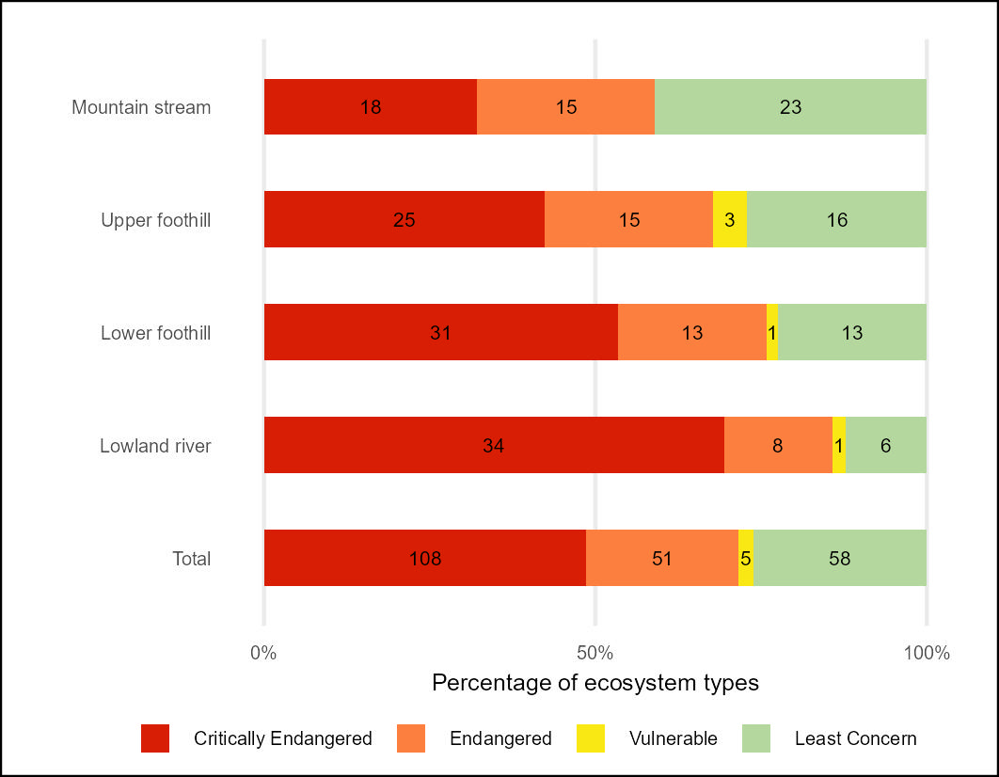

## **Workflows for undertaking the river Red List of Ecosystems (RLE) assessment**

### **National Biodiversity Assessment - South Africa**

*South African National Biodiversity Institute (SANBI)*

June 2025

#### **Summary**

This repository contains a workflow that results in the NBA 2025 Red List of Ecosystems indicators for River Ecosystems of South Africa.

The Quarto document [Riv_RLE.qmd](Riv_RLE.qmd) describes the import of the South African rivers database (v20250610) prepared by SANBI. The data were imported using the sf package in R and summarised using the tidyverse in R.

The Red List of Ecosystems (known as Ecosystem Threat Status in South Africa) assesses the risk of collapse of each ecosystem type based on a range of criteria on extent condition and pressures faced by each ecosystem type. For consistency with past NBAs this assessment follows the methods developed by [Nel et al., 2007](DOI: 10.1111/j.1472-4642.2006.00308.x) and modified by [van Deventer et al., 2019](http://hdl.handle.net/20.500.12143/5847). Each of the 222 river ecosystems types were assigned to one of the four risk categories: Critically Endangered, Endangered, Vulnerable and Least Concern.

The analysis approach of van Deventer et al., 2019 uses the proportion of each ecosystem type that is in a good - fair condition (PES class A B and C) and a set of thresholds. If less than 20% of a type (measured by length of river segment) is in a A or B condition then the type is categorised as Critically Endangered; if between 20-35% of the type is in A or B condition then the type is categorised as Endangered; If less than 60% of the type is in A or or C condition then the type is categorised as Vulnerable; if none of these thresholds are crossed then the type is Least Concern. This methods aligns with the South African Framework for Threatened ecosystems but not the IUCN RLE 1.1. Processes to transition to the IUCN framework are underway - but in the interest of comparing past results the 2011 methods have been implemented.

#### **Results:**

Overall per-ecosystem type RLE 2024 results using South African methods (Nel et al., 2011) and IUCN RLE methods [rle_riv_metrics_per_type.csv](outputs/rle_riv_metrics_per_type.csv)

Summary table - count of river ecosystem types per slope zone per South African RLE category [rle24_sa_riv_count.csv](outputs/rle24_sa_riv_count.csv)

