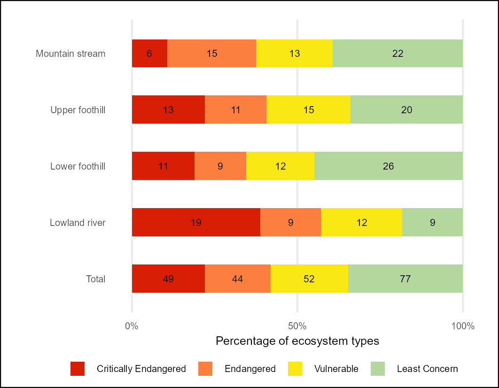

## **Workflows for undertaking the river Red List of Ecosystems (RLE) assessment**

### **National Biodiversity Assessment - South Africa**

*South African National Biodiversity Institute (SANBI)*

June 2025

#### **Summary**

This repository contains a workflow that results in the NBA 2025 Red List of Ecosystems indicators for River Ecosystems of South Africa.

The Quarto document [Riv_RLE.qmd](Riv_RLE.qmd) describes the import of the South African rivers database (v20250610) prepared by SANBI. The data were imported using the sf package in R and summarised using the tidyverse in R. The dataset covers 222 river ecosystem types includes per-feature Present Ecological Stats (PES) scores (A-F, [good to very poor]) developed by XXX

The Red List of Ecosystems (also known as Ecosystem Threat Status in South Africa) assesses the risk of collapse of each ecosystem type based on a range of criteria on extent, condition and pressures faced by each ecosystem type.

The IUCN RLE (v2) approach was followed and Criterion D3 was applied to the Present Ecological State (PES) data such that Severity \>=90% was assigned to PES classes E-F; Severity \>=70% was assigned to PES classes D-F; Severity \>=50% was assigned to PES classes C-F. Criterion B1a(iii) was applied using EOO calculations with ongoing decline defined as a decline in the extent of good/fair condition river length (PES Classes A, B, C) from the previous PES assessment period. Each of the 222 river ecosystems types were assigned to one of the four risk categories: Critically Endangered, Endangered, Vulnerable and Least Concern. The highest risk category for these two criteria is selected as the threat / risk status for each river type.

For consistency with past assessments the South African Ecosystem Threat Status framework (developed by [Nel et al., 2010](DOI:%2010.1111/j.1472-4642.2006.00308.x) and modified by [van Deventer et al., 2019](http://hdl.handle.net/20.500.12143/5847)) was applied in a separate assessment. This approach uses the proportion of each ecosystem type that is in a good - fair condition (PES class A B and C) and a set of thresholds. If less than 20% of a type (measured by length of river segment) is in a A or B condition then the type is categorised as Critically Endangered; if between 20-35% of the type is in A or B condition then the type is categorised as Endangered; If less than 60% of the type is in A or B or C condition then the type is categorised as Vulnerable; if none of these thresholds are crossed then the type is Least Concern. The results are referred to as ETS (Ecosystem Threat Status) to differentiate them from RLE results.

#### **Results:**

The assessment results per river ecosystem type for both the IUCN RLE and South African ETS are presented here [rle_riv_metrics_per_type.csv](outputs/rle_riv_metrics_per_type.csv).

Summary table - count of river ecosystem types per slope zone per IUCN RLE category [rle24_riv_count.csv](outputs/rle24_riv_count.csv)

Summary table - count of river ecosystem types per slope zone per South African ETS category [rle24sa_riv_count.csv](outputs/rle24sa_riv_count.csv)

| RLE 2024 - Rivers | ETS 2024 - Rivers |
|------------------------------------|------------------------------------|
|  |  |

**RLE Index**

Reflecting changes in RLE between 2018 and 2024

|                               |     |
|-------------------------------|-----|
|  |     |

**Combined RLE and EPL results**

The Quarto document [RLE_EPL_results.qmd](RLE_EPL_results.qmd) describes the combination of the RLE and EPL results and the production of a spatial version of the results attached to river line map.

**Highly threatened and under-protected ecosystems**

36% of river types (82/222) are highly threatened (EN/CR) and under protected (NP/ PP), but 50% of Lowland rivers fall into this category.
